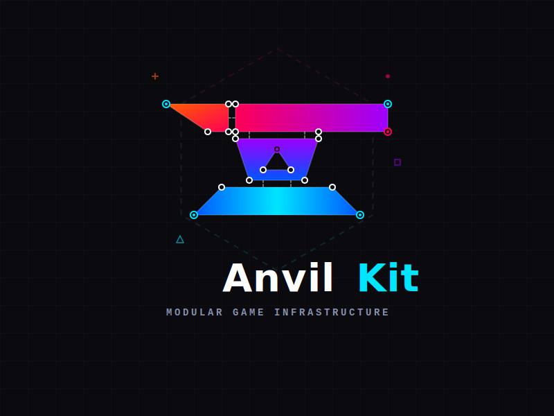

<div align="center">



<br/><br/>

模块化游戏引擎 — 用可组合的 Rust crate 锻造游戏。

[](https://crates.io/crates/anvilkit)
[](https://docs.rs/anvilkit)
[](LICENSE-MIT)
[](https://github.com/ketd/AnvilKit/actions)

[文档](https://anvilkit.io) · [快速开始](https://anvilkit.io/zh/docs/getting-started) · [示例游戏](https://anvilkit.io/zh/docs/games/craft) · [crates.io](https://crates.io/crates/anvilkit)

**[English](README.md)** | 中文

</div>

---

## AnvilKit 是什么？

AnvilKit 是一套**模块化游戏基础设施** — 不是单体引擎，而是一组专注的 crate，你可以自由组合来构建你需要的游戏。

```toml
# 使用 facade crate 一键引入全部：
[dependencies]
anvilkit = "0.1"

# 或按需选取单个 crate：
[dependencies]
anvilkit-core = "0.1"
anvilkit-ecs = "0.1"
anvilkit-render = "0.1"
```

```rust
use anvilkit::prelude::*;

fn main() {
    let mut app = App::new();
    app.add_plugins(RenderPlugin::default());
    app.add_systems(AnvilKitSchedule::Update, hello);
    RenderApp::run(app);
}

fn hello() {
    println!("Hello from AnvilKit!");
}
```

## 模块地图

```
                        ┌──────────┐
                        │ anvilkit │  ← 门面 crate，统一导出
                        └────┬─────┘
          ┌──────┬──────┬────┼────┬───────┬────────┐
          ▼      ▼      ▼    ▼    ▼       ▼        ▼
      ┌──────┐┌─────┐┌──────┐┌──────┐┌───────┐┌───────┐┌────────┐
      │ core ││ ecs ││render││assets││ input ││ audio ││ camera │
      └──────┘└──┬──┘└──┬───┘└──────┘└───────┘└───────┘└────────┘
                 │      │
            bevy_ecs   wgpu + winit
```

| Crate | 功能 | 核心依赖 |
|-------|------|----------|
| **anvilkit-core** | 数学库 (glam)、变换、时间、错误处理 | `glam` |
| **anvilkit-ecs** | ECS 世界、调度器、插件、物理系统 | `bevy_ecs` |
| **anvilkit-render** | 窗口管理、GPU 管线、精灵、粒子、UI、文本 | `wgpu`, `winit` |
| **anvilkit-assets** | glTF 加载、资源服务器、程序化网格生成 | `gltf` |
| **anvilkit-input** | 键盘/鼠标/手柄状态、动作映射 | `winit` |
| **anvilkit-audio** | 空间音频、播放控制、混音 | `rodio` |
| **anvilkit-camera** | 第一/第三人称控制器、特效、震动 | — |

## 示例游戏

<table>
<tr>
<td width="50%">

### Craft

Minecraft 风格体素沙盒 — 地形生成、方块建造、水体渲染、昼夜循环、贪心网格化、生命系统（摔落伤害与溺水）、槽位背包、数据驱动方块、玩家状态持久化。

```bash
cargo run -p craft
```

</td>
<td width="50%">

### Billiards

PBR 台球模拟 — AABB 物理、球与球碰撞、开球规则、得分系统、轨道摄像机控制。

```bash
cargo run -p billiards
```

</td>
</tr>
</table>

## CLI 工具

`anvil` 命令行工具可以从模板快速创建新项目：

```bash
cargo install anvilkit-cli
anvil new my-game --template first_person
cd my-game && cargo run
```

内置模板：`3d_basic`、`first_person`、`topdown`

## 从源码构建

```bash
git clone https://github.com/ketd/AnvilKit.git
cd AnvilKit
cargo build --workspace
cargo test --workspace
```

本地运行文档站：

```bash
cd docs && pnpm install && pnpm dev
```

## 许可证

双许可：[MIT](LICENSE-MIT) 或 [Apache 2.0](LICENSE-APACHE)，任选其一。

## 致谢

构建于 [Bevy ECS](https://bevyengine.org/) · [wgpu](https://wgpu.rs/) · [winit](https://github.com/rust-windowing/winit) · [glam](https://github.com/bitshifter/glam-rs) · [rodio](https://github.com/RustAudio/rodio) 之上。

<div align="center">

---

**用 Rust 锻造游戏的未来 🔨**

</div>
